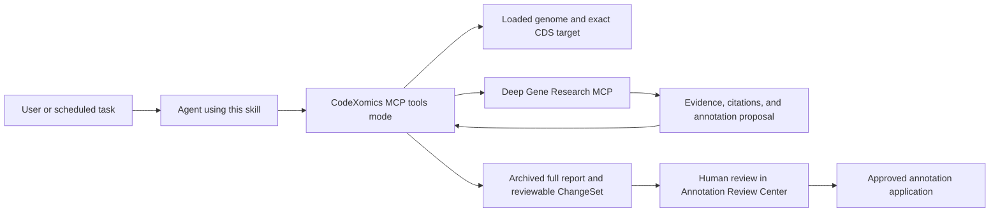

# Genome Annotation Skills

Production-oriented agent skills and automation tools for evidence-backed genome annotation refinement with [CodeXomics](https://github.com/Scilence2022/CodeXomics) and [Deep Gene Research](https://github.com/Scilence2022/DeepGeneResearch).

The repository currently provides `curate-genome-annotations`, a skill that can load a genome, research exact CDS features, and create human-reviewable annotation ChangeSets for:

- one specified gene;
- an explicit gene list or gene file;
- a deterministic daily batch, such as 10 CDS features per day.

It supports external MCP agents—including Codex, Claude, and OpenClaw-style clients—as well as the internal CodeXomics ChatBox with DGR connected through MCP.

## How it works



CodeXomics remains the authority for genome identity, organism metadata, feature coordinates, current qualifiers, and annotation revision. DGR performs evidence research and proposal synthesis. Automated research stops after creating a ChangeSet; approval and application remain separate human-curator actions.

## Safety model

The included workflow enforces the following boundaries:

- only features resolved by CodeXomics as `CDS` are processed;
- every target requires a stable `locus_tag` or `protein_id`;
- ambiguous targets are rejected instead of guessed;
- full DGR reports are archived as genome-scoped attachments;
- unattended agents never approve or apply their own ChangeSets;
- research and curator credentials use separate permission scopes;
- batch runs use durable state, semantic idempotency, and a per-genome lock.

See the complete agent contract in [`curate-genome-annotations/SKILL.md`](curate-genome-annotations/SKILL.md).

## Repository layout

```text
curate-genome-annotations/
├── SKILL.md                         # Agent-facing operating contract
├── agents/openai.yaml               # Skill discovery metadata
├── scripts/
│   ├── bootstrap_repositories.py    # Clone and install CodeXomics and DGR
│   ├── start_services.py            # Reuse, check, or start both MCP services
│   ├── run_annotation_workflow.py   # Single, list, and daily CDS workflows
│   └── mcp_http.py                  # Dependency-free MCP HTTP client
└── references/
    ├── setup.md
    ├── configuration.md
    ├── workflows.md
    ├── automation.md
    └── troubleshooting.md
```

## Prerequisites

- Python 3.10 or newer for the bundled scripts;
- Git;
- Node.js 20 or 22 and npm 10+ for CodeXomics;
- Node.js 18.18+, npm 9.8+, and pnpm for DGR;
- a configured model provider and a working DGR search provider;
- macOS, Linux, or another environment capable of running the CodeXomics Electron application.

## Quick start

### 1. Clone this repository

```bash
git clone https://github.com/Scilence2022/GenomeAnnotationSkills.git
cd GenomeAnnotationSkills
```

Agents with compatible skill discovery can install or link the `curate-genome-annotations` directory into their local skills directory. The scripts can also be used directly without native skill discovery.

### 2. Download or reuse CodeXomics and DGR

The bootstrap script skips valid existing checkouts and never pulls, switches, or overwrites them automatically.

```bash
python3 curate-genome-annotations/scripts/bootstrap_repositories.py \
  --codexomics-dir /absolute/path/CodeXomics \
  --dgr-dir /absolute/path/deep-gene-research
```

Use `--skip-install` when dependencies are already installed, or `--dry-run` to inspect the commands first.

### 3. Configure authentication, models, and search

Keep credentials in the environment or a protected service manager. A research agent should receive only:

```text
annotation:read
annotation:research
annotation:propose
```

Do not give an unattended agent `annotation:approve` or `annotation:commit`.

For scoped CodeXomics keys, DGR authentication, model-provider variables, durable task storage, and local SearXNG configuration, read [`references/configuration.md`](curate-genome-annotations/references/configuration.md).

### 4. Start or validate the services

```bash
python3 curate-genome-annotations/scripts/start_services.py \
  --codexomics-dir /absolute/path/CodeXomics \
  --dgr-dir /absolute/path/deep-gene-research
```

Default local endpoints:

- CodeXomics MCP tools mode: `http://127.0.0.1:3002/mcp`
- DGR MCP: `http://127.0.0.1:3000/api/mcp`

If both services are already running, validate and reuse them:

```bash
python3 curate-genome-annotations/scripts/start_services.py --check-only
```

### 5. Dry-run target resolution

Always dry-run a new genome or selection policy before starting research:

```bash
python3 curate-genome-annotations/scripts/run_annotation_workflow.py \
  --genome /absolute/path/genome.gbk \
  --gene lysC \
  --dry-run
```

The dry-run loads or reuses the specified genome, binds the correct CodeXomics window, and verifies that the target resolves to an eligible CDS. It does not start DGR or create a ChangeSet.

## Annotation examples

### One gene

```bash
python3 curate-genome-annotations/scripts/run_annotation_workflow.py \
  --genome /absolute/path/genome.gbk \
  --gene lysC \
  --user-prompt "Refine function, regulation, pathway role, complexes, phenotype, and database cross-references with precise citations"
```

### Explicit gene list

```bash
python3 curate-genome-annotations/scripts/run_annotation_workflow.py \
  --genome /absolute/path/genome.gbk \
  --genes lysC,thrB,talB
```

### Gene file

```bash
python3 curate-genome-annotations/scripts/run_annotation_workflow.py \
  --genome /absolute/path/genome.gbk \
  --gene-file /absolute/path/genes.txt
```

The gene file accepts newline-, comma-, or tab-separated identifiers. Lines may contain comments beginning with `#`.

### Daily batch

```bash
python3 curate-genome-annotations/scripts/run_annotation_workflow.py \
  --genome /absolute/path/genome.gbk \
  --daily-count 10 \
  --state-dir "$HOME/.local/state/genome-annotation-skills" \
  --output /absolute/path/latest-annotation-run.json
```

Daily selection is deterministic and resumable. By default it excludes CDS features already covered by successful daily state and targets with an active, approved, or committed ChangeSet.

Scheduling should be handled by the agent platform's recurring automation system or a supervised scheduler. Read [`references/automation.md`](curate-genome-annotations/references/automation.md) before creating a schedule.

## Human review

A successful research run reports, per gene:

- the resolved CDS target;
- DGR task status and task ID;
- archived report attachment metadata;
- annotation proposal status;
- ChangeSet ID and review status;
- any failure or skipped reason.

The curator then opens **Annotation Review Center** in CodeXomics to inspect citations and current-versus-proposed qualifiers. Eligible ChangeSets may be selected for batch review. Research completion alone does not mean the source genome was modified.

## Documentation

- [Skill operating contract](curate-genome-annotations/SKILL.md)
- [Installation and service startup](curate-genome-annotations/references/setup.md)
- [Authentication, models, search, and durability](curate-genome-annotations/references/configuration.md)
- [External MCP and internal ChatBox workflows](curate-genome-annotations/references/workflows.md)
- [Recurring automation](curate-genome-annotations/references/automation.md)
- [Troubleshooting](curate-genome-annotations/references/troubleshooting.md)

## Validation

Run the dependency-free unit tests:

```bash
python3 -m unittest discover \
  -s curate-genome-annotations/scripts/tests \
  -v
```

Validate the Skill structure with the Codex `skill-creator` validator when it is available:

```bash
python3 "$CODEX_HOME/skills/.system/skill-creator/scripts/quick_validate.py" \
  curate-genome-annotations
```

## Related projects

- [CodeXomics](https://github.com/Scilence2022/CodeXomics) — genome visualization, MCP tools, annotation sidecars, report attachments, ChangeSets, and human review.
- [Deep Gene Research](https://github.com/Scilence2022/DeepGeneResearch) — durable evidence search, source filtering, citation validation, full-report generation, and structured annotation proposals.

## Contributing

Contributions should preserve the central safety boundary: automated research may create evidence-backed proposals, but a distinct human curator controls approval and application. Include tests for workflow, security, state-recovery, or MCP transport changes.
