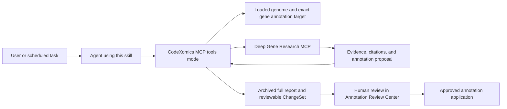

# Genome Annotation Skills

Production-oriented agent skills and automation tools for evidence-backed genome annotation refinement with [CodeXomics](https://github.com/Scilence2022/CodeXomics) and [Deep Gene Research](https://github.com/Scilence2022/DeepGeneResearch).

The repository currently provides `curate-genome-annotations`, a skill that can load a genome, prioritize exact coding and non-coding gene annotation features, and create human-reviewable annotation ChangeSets for:

- one specified gene;
- an explicit gene list or gene file;
- a deterministic daily batch, such as the 10 lowest-quality eligible features per day.

It supports Codex, Claude Code, TRAE Work, WorkBuddy/CodeBuddy, and other
external MCP agents, as well as the internal CodeXomics ChatBox with DGR
connected through MCP. See [Client compatibility](curate-genome-annotations/references/clients.md).

## How it works


```mermaid
flowchart LR
    U["User or scheduled task"] --> A["Agent using this skill"]
    A --> C["CodeXomics MCP tools mode"]
    C --> G["Loaded genome and exact gene annotation target"]
    C --> D["Deep Gene Research MCP"]
    D --> E["Evidence, citations, and annotation proposal"]
    E --> C
    C --> R["Archived full report and reviewable ChangeSet"]
    R --> H["Human review in Annotation Review Center"]
    H --> P["Approved annotation application"]
```

CodeXomics remains the authority for genome identity, organism metadata, feature coordinates, current qualifiers, and annotation revision. DGR performs evidence research and proposal synthesis. Automated research stops after creating a ChangeSet; approval and application remain separate human-curator actions.

## Safety model

The included workflow enforces the following boundaries:

- supported coding, non-coding RNA, transcript, gene, and pseudogene features are processed; co-located records prefer CDS;
- every target requires a stable `locus_tag` or `protein_id`;
- ambiguous targets are rejected instead of guessed;
- full DGR reports are archived as genome-scoped attachments;
- unattended agents never approve or apply their own ChangeSets;
- research and curator credentials use separate permission scopes;
- batch runs use durable state, semantic idempotency, and a per-genome lock.

See the complete agent contract in [`curate-genome-annotations/SKILL.md`](curate-genome-annotations/SKILL.md).

## Repository layout

```text
curate-genome-annotations/
├── SKILL.md                         # Agent-facing operating contract
├── agents/openai.yaml               # Skill discovery metadata
├── scripts/
│   ├── bootstrap_repositories.py    # Clone and install CodeXomics and DGR
│   ├── start_services.py            # Reuse, check, or start both MCP services
│   ├── run_annotation_workflow.py   # Single, list, and quality-ranked daily workflows
│   ├── generate_run_report.py       # Comprehensive token/cost/runtime/evidence run report
│   ├── install_schedule.py          # launchd, systemd, or cron daily schedule generator
│   ├── install_for_clients.py       # Copy/symlink the skill into client homes (plan-first)
│   ├── run_metrics.py               # Token, cost, runtime, and reference accounting
│   ├── dgr_telemetry.py             # Read-only DGR accounting lookup
│   └── mcp_http.py                  # Dependency-free MCP HTTP client
└── references/
    ├── setup.md
    ├── configuration.md
    ├── clients.md
    ├── workflows.md
    ├── automation.md
    ├── reporting.md
    ├── pricing.template.json
    └── troubleshooting.md
```

## Prerequisites

- Python 3.10 or newer for the bundled scripts;
- Git;
- Node.js 20 or 22 and npm 10+ for CodeXomics;
- Node.js 18.18+, npm 9.8+, and pnpm for DGR;
- a configured model provider and a working DGR search provider;
- macOS, Linux, or another environment capable of running the CodeXomics Electron application.

## Quick start

### 1. Clone this repository

```bash
git clone https://github.com/Scilence2022/GenomeAnnotationSkills.git
cd GenomeAnnotationSkills
```

Link the skill directory into the agent's skills path so it is discovered by name:

```bash
ln -s "$PWD/curate-genome-annotations" "${CODEX_HOME:-$HOME/.codex}/skills/curate-genome-annotations"   # Codex
ln -s "$PWD/curate-genome-annotations" "$HOME/.claude/skills/curate-genome-annotations"                 # Claude Code
ln -s "$PWD/curate-genome-annotations" "$HOME/.trae-cn/skills/curate-genome-annotations"                # TRAE Work
ln -s "$PWD/curate-genome-annotations" "$HOME/.codebuddy/skills/curate-genome-annotations"              # WorkBuddy / CodeBuddy
```

A symlink keeps the installed skill in step with `git pull`. Alternatively use
`python3 curate-genome-annotations/scripts/install_for_clients.py --check` to
print a plan for every client, then `--install` the ones you want. The scripts
can also be run directly, without native skill discovery.

### 2. Download or reuse CodeXomics and DGR

The bootstrap script skips valid existing checkouts and never pulls, switches, or overwrites them automatically.

```bash
python3 curate-genome-annotations/scripts/bootstrap_repositories.py \
  --codexomics-dir /absolute/path/CodeXomics \
  --dgr-dir /absolute/path/deep-gene-research
```

Use `--skip-install` when dependencies are already installed, or `--dry-run` to inspect the commands first.

### 3. Configure authentication, models, and search

Keep credentials in the environment or a protected service manager. A research agent should receive only:

```text
annotation:read
annotation:research
annotation:propose
```

Do not give an unattended agent `annotation:approve` or `annotation:commit`.

For scoped CodeXomics keys, DGR authentication, model-provider variables, durable task storage, and local SearXNG configuration, read [`references/configuration.md`](curate-genome-annotations/references/configuration.md).

### 4. Start or validate the services

```bash
python3 curate-genome-annotations/scripts/start_services.py \
  --codexomics-dir /absolute/path/CodeXomics \
  --dgr-dir /absolute/path/deep-gene-research
```

Default local endpoints:

- CodeXomics MCP tools mode: `http://127.0.0.1:3002/mcp`
- DGR MCP: `http://127.0.0.1:3000/api/mcp`

If both services are already running, validate and reuse them:

```bash
python3 curate-genome-annotations/scripts/start_services.py --check-only
```

### 5. Dry-run target resolution

Always dry-run a new genome or selection policy before starting research:

```bash
python3 curate-genome-annotations/scripts/run_annotation_workflow.py \
  --genome /absolute/path/genome.gbk \
  --gene lysC \
  --dry-run
```

The dry-run loads or reuses the specified genome, binds the correct CodeXomics window, and verifies that the target resolves to an eligible gene-associated feature. It does not start DGR or create a ChangeSet.

## Annotation examples

### One gene

```bash
python3 curate-genome-annotations/scripts/run_annotation_workflow.py \
  --genome /absolute/path/genome.gbk \
  --gene lysC \
  --user-prompt "Refine function, regulation, pathway role, complexes, phenotype, and database cross-references with precise citations"
```

### Explicit gene list

```bash
python3 curate-genome-annotations/scripts/run_annotation_workflow.py \
  --genome /absolute/path/genome.gbk \
  --genes lysC,thrB,talB
```

### One gene with user PDF full text

```bash
python3 curate-genome-annotations/scripts/run_annotation_workflow.py \
  --genome /absolute/path/genome.gbk \
  --gene lysC \
  --pdf /absolute/path/primary-study.pdf \
  --pdf /absolute/path/supplementary-study.pdf \
  --full-text-policy require
```

PDF inputs are available only for a single explicit gene. CodeXomics registers each validated PDF as a gene-scoped attachment; DGR parses text-bearing pages, continues web/database retrieval plus its open full-text waterfall (Europe PMC, PubTator, bioRxiv, OpenAlex, CORE, Unpaywall), and records exact full-text excerpts with content hashes and offsets. `require` fails the run outcome if no verified full-text source survives exact-target screening. Image-only scans currently report an OCR limitation instead of being mislabeled as full text.

### Gene file

```bash
python3 curate-genome-annotations/scripts/run_annotation_workflow.py \
  --genome /absolute/path/genome.gbk \
  --gene-file /absolute/path/genes.txt
```

The gene file accepts newline-, comma-, or tab-separated identifiers. Lines may contain comments beginning with `#`.

### Daily batch

```bash
python3 curate-genome-annotations/scripts/run_annotation_workflow.py \
  --genome /absolute/path/genome.gbk \
  --daily-count 10 \
  --selection-policy low-quality \
  --maximum-quality-score 70 \
  --state-dir "$HOME/.local/state/genome-annotation-skills" \
  --output /absolute/path/latest-annotation-run.json
```

Daily selection is deterministic and resumable. By default it ranks the lowest-quality supported features first and asks CodeXomics to exclude targets with active or durably archived completed DGR research, independent of the agent's local state directory. It also excludes targets with an active, approved, or committed ChangeSet. Use `--research-refresh-days N` for periodic refresh or `--include-researched` for an intentional repeat campaign.

Three ranking policies decide which eligible genes a batch takes:

| `--selection-policy` | Picks | Quality threshold |
| --- | --- | --- |
| `low-quality` (default) | Worst-annotated features first | Honours `--maximum-quality-score` |
| `coordinate` | Coordinate order, for reproducible full coverage | Ignored |
| `random` | An unbiased sample of the eligible pool | Honours `--maximum-quality-score`; pass 100 to sample the whole genome |

All three apply *after* every coverage exclusion, so no policy can re-select an already-researched gene. `random` is seeded and reproducible — same seed, same genes — so an interrupted batch resumes rather than paying for a fresh sample. Seed it with `--random-seed` or a stable `--run-id`.

Scheduling should be handled by the agent platform's recurring automation system or a supervised scheduler. `scripts/install_schedule.py` generates a launchd, systemd, or cron schedule that runs the batch and then its report; it prints everything and writes nothing unless `--install` is passed. Read [`references/automation.md`](curate-genome-annotations/references/automation.md) before creating a schedule.

## Run statistics and cost

A batch accounts for what it consumed and what it produced. Two different models bill for one annotated gene — the research model DGR runs internally and the agent model driving the skill — so they are counted in separate ledgers and reported on separate rows, never summed into one number.

```bash
python3 curate-genome-annotations/scripts/run_annotation_workflow.py \
  --genome /absolute/path/genome.gbk \
  --daily-count 10 \
  --run-id daily-2026-08-20 \
  --pricing-file /protected/path/pricing.json \
  --agent-usage-file /durable/path/agent-usage.jsonl \
  --output /reports/2026-08-20-summary.json \
  --metrics-output /reports/2026-08-20-metrics.json

python3 curate-genome-annotations/scripts/generate_run_report.py \
  /reports/2026-08-20-summary.json \
  --markdown-output /reports/2026-08-20-report.md \
  --json-output /reports/2026-08-20-report.json
```

The report covers tokens per model, actual cost, runtime per gene and in total, references surveyed and newly added, full texts adopted, and newly incorporated information.

Every number comes from something a service reported. Nothing is estimated from character counts or elapsed time, and a statistic no service reported is shown as `unavailable` with its reason rather than as zero — including cost when no price list is configured, and agent-model tokens when the agent did not write its usage sidecar. Read [`references/reporting.md`](curate-genome-annotations/references/reporting.md) for where each statistic originates and what to do about each gap.

## Human review

A successful research run reports, per gene:

- the resolved feature type and exact target;
- DGR task status and task ID;
- archived report attachment metadata;
- verified full-text source and finding counts when available;
- annotation proposal status;
- ChangeSet ID and review status;
- any failure or skipped reason.

The curator then opens **Annotation Review Center** in CodeXomics to inspect citations and current-versus-proposed qualifiers. Eligible ChangeSets may be selected for batch review. Research completion alone does not mean the source genome was modified.

## Documentation

- [Skill operating contract](curate-genome-annotations/SKILL.md)
- [Installation and service startup](curate-genome-annotations/references/setup.md)
- [Authentication, models, search, and durability](curate-genome-annotations/references/configuration.md)
- [External MCP and internal ChatBox workflows](curate-genome-annotations/references/workflows.md)
- [Client compatibility](curate-genome-annotations/references/clients.md)
- [Recurring automation](curate-genome-annotations/references/automation.md)
- [Run statistics and reporting](curate-genome-annotations/references/reporting.md)
- [Troubleshooting](curate-genome-annotations/references/troubleshooting.md)
- [Upstream changes for CodeXomics and DGR](integration/README.md)

## Validation

Run the dependency-free unit tests:

```bash
python3 -m unittest discover \
  -s curate-genome-annotations/scripts/tests \
  -v
```

Validate the Skill structure with the Codex `skill-creator` validator when it is available:

```bash
python3 "$CODEX_HOME/skills/.system/skill-creator/scripts/quick_validate.py" \
  curate-genome-annotations
```

## Related projects

- [CodeXomics](https://github.com/Scilence2022/CodeXomics) — genome visualization, MCP tools, annotation sidecars, report attachments, ChangeSets, and human review.
- [Deep Gene Research](https://github.com/Scilence2022/DeepGeneResearch) — durable evidence search, source filtering, citation validation, full-report generation, and structured annotation proposals.

## Contributing

Contributions should preserve the central safety boundary: automated research may create evidence-backed proposals, but a distinct human curator controls approval and application. Include tests for workflow, security, state-recovery, or MCP transport changes.
